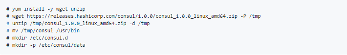
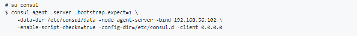
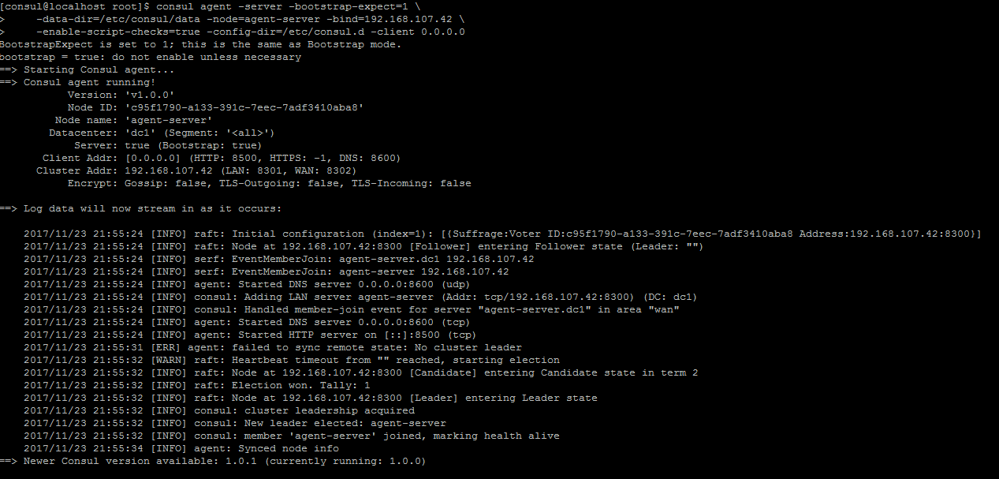
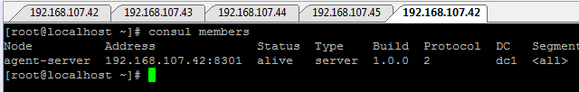

### Examen 3
**Universidad ICESI**  
**Curso:** Sistemas Operativos  
**Docente:** Daniel Barragán C.  
**Tema:** Descubrimiento de servicios, Microservicios  
**Correo:** daniel.barragan at correo.icesi.edu.co  
**Estudiantes:** Jhon Eduar Tobar Gómez - A00316212  
                 Carlos Andres Torres - A00141804 
                 
**GitHub URL:**  https://github.com/Jhongomez6/so-exam3

### Objetivos
* Implementar servicios web que puedan ser consumidos por usuarios o aplicaciones
* Conocer y emplear tecnologías de descubrimiento de servicio

### Prerrequisitos
* Virtualbox o WMWare
* Máquina virtual con sistema operativo CentOS7
* Framework consul, zookeper o etcd

### Descripción
El tercer parcial del curso sistemas operativos trata sobre la creación de servicios web y el uso de tecnologías para el descubrimiento de servicio

![][1]
**Figura 1.** Despliegue básico de microservicios

### Actividades
1. Incluir nombre, código (5%)
2. Ortografía y redacción cuando sea necesario (5%)
3. Despliegue un esquema como el mostrado en la **figura 1**. Empleen un servicio web de su preferencia (puede usar alguno de los ejemplos de clase). No es necesario incluir los componentes para monitoreo (Elasticsearch, Kibana, Logstash) (30%)
4. Adicione un microservicio igual al ya desplegado. Muestre a través de evidencias como las peticiones realizadas al balanceador son dirigidas a la replica del microservicio (30%)
5. Describa los cambios o adiciones necesarias en el diagrama de la **figura 1** para adicionar un microservicio diferente al ya desplegado en el ambiente, tenga en cuenta los siguientes conceptos en su descripción: API Gateway, paradigma reactivo, load balancer, protocolo publicador/suscriptor (interconexión de microservicios) (20%)
6. El informe debe ser entregado en formato pdf a través del moodle y el informe en formato README.md debe ser subido a un repositorio de github. El repositorio de github debe ser un fork de https://github.com/ICESI-Training/so-exam3 y para la entrega deberá hacer un Pull Request (PR) respetando la estructura definida. El código fuente y la url de github deben incluirse en el informe (10%)  

---------------------------------------------------------------------------------------------------------------------------------------

### Solución:

3. Para desplegar el esquema mostrado en la figura lo primero que hacemos es configurar el componente consult server en un nodo:

### Consul Server

Primero instalamos las dependencias necesarias:

Creamos un usuario consul para ejecutar el agente consul como servidor con adduser consul y passwd consul para definir la contraseña del usuario. Luego de esto, le damos permisos al usuario creado y abrimos los puertos necesarios en el firewall para el agente consul:

Ahora bien, iniciamos el agente consul en modo servidor con el siguiente comando (Se recomienda usar una sesión de screen para correr el proceso en background):

Vemos como el agente empieza a correr y queda activo:

Asi mismo, podemos verificar la lista de los miembros del ambiente de descubrimiento de servicio con el comando: consul members y verificar que el agente servidor esté en la lista:

### Microservico A

5. Dentro del nodo que  esta sirviendo de web service se crea un nuevo contenedor y dentro de este contenedor se despliega un nuevo servicio 
web que en este caso seria un nuevo artefacto phyton source (un nuevo contenedor, con un servicio web diferente desplegado dentro de él), aqui 
se entraria a hacer uso del patron APi Gateway, ya que la implementación de este patron permite redijir la solicitud hacia el servicio web solicitado,
funciona como una especie de router (mirandolo desde el punto de vista de redes informaticas).  
Para la solución que nosotros proponemos es usar API Gateway. Sin embargo, hay diferentes formas de darle solución a este problema como por ejemplo:

Protcolo publicador/suscriptor

### Referencias
https://github.com/ICESI/so-microservices-python  
http://microservices.io/patterns/microservices.html
http://microservices.io/patterns/apigateway.html

[1]: images/Microservices_Deployment.png
