### Examen 3
**Universidad ICESI**  
**Curso:** Sistemas Operativos  
**Docente:** Daniel Barragán C.  
**Tema:** Descubrimiento de servicios, Microservicios  
**Correo:** daniel.barragan at correo.icesi.edu.co  
**Estudiantes:** Jhon Eduar Tobar Gómez - A00316212  
                 Carlos Andres Torres - A00141804 
                 
**GitHub URL:**  https://github.com/Jhongomez6/so-exam3

### Objetivos
* Implementar servicios web que puedan ser consumidos por usuarios o aplicaciones
* Conocer y emplear tecnologías de descubrimiento de servicio

### Prerrequisitos
* Virtualbox o WMWare
* Máquina virtual con sistema operativo CentOS7
* Framework consul, zookeper o etcd

### Descripción
El tercer parcial del curso sistemas operativos trata sobre la creación de servicios web y el uso de tecnologías para el descubrimiento de servicio

### Actividades
1. Incluir nombre, código (5%)
2. Ortografía y redacción cuando sea necesario (5%)
3. Despliegue un esquema como el mostrado en la **figura 1**. Empleen un servicio web de su preferencia (puede usar alguno de los ejemplos de clase). No es necesario incluir los componentes para monitoreo (Elasticsearch, Kibana, Logstash) (30%)
4. Adicione un microservicio igual al ya desplegado. Muestre a través de evidencias como las peticiones realizadas al balanceador son dirigidas a la replica del microservicio (30%)
5. Describa los cambios o adiciones necesarias en el diagrama de la **figura 1** para adicionar un microservicio diferente al ya desplegado en el ambiente, tenga en cuenta los siguientes conceptos en su descripción: API Gateway, paradigma reactivo, load balancer, protocolo publicador/suscriptor (interconexión de microservicios) (20%)
6. El informe debe ser entregado en formato pdf a través del moodle y el informe en formato README.md debe ser subido a un repositorio de github. El repositorio de github debe ser un fork de https://github.com/ICESI-Training/so-exam3 y para la entrega deberá hacer un Pull Request (PR) respetando la estructura definida. El código fuente y la url de github deben incluirse en el informe (10%)  

---------------------------------------------------------------------------------------------------------------------------------------

### Solución:

3. Para desplegar el esquema mostrado en la figura lo primero que hacemos es configurar el componente consult server en un nodo:

### Consul Server

Primero instalamos las dependencias necesarias:

Creamos un usuario consul para ejecutar el agente consul como servidor con adduser consul y passwd consul para definir la contraseña del usuario. Luego de esto, le damos permisos al usuario creado y abrimos los puertos necesarios en el firewall para el agente consul:

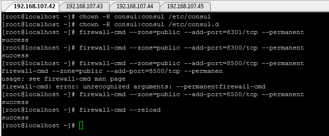

Ahora bien, iniciamos el agente consul en modo servidor con el siguiente comando (Se recomienda usar una sesión de screen para correr el proceso en background):

Vemos como el agente empieza a correr y queda activo:

Asi mismo, podemos verificar la lista de los miembros del ambiente de descubrimiento de servicio con el comando: consul members y verificar que el agente servidor esté en la lista:

### Microservico A

Ahora en un nodo diferente configuramos el primer microservicio y lo primero para esto es instalar las dependecias necesarias:

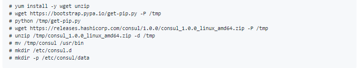

Como lo hicimos anteriormente, creamos un usuario consul, le asignamos permisos y abrimos los puertos en el firewall para el agente:

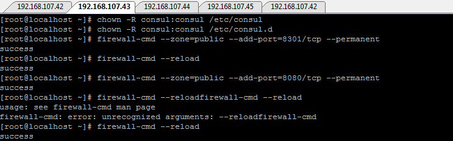

Para ejecutar el microservicio creamos un usuario llamado microservices y asi mismo, creamos un ambiente llamado microservice_a  y lo activamos:

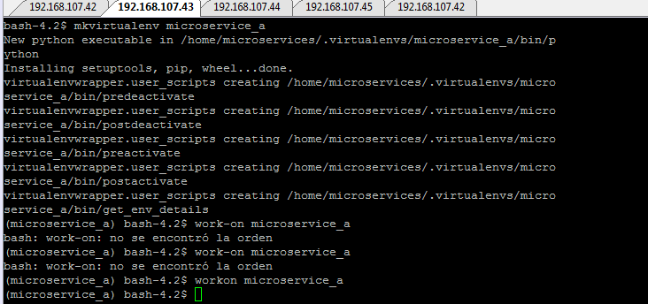

Instalamos la libeeria flask en el ambiente, creamos y ejecutamos el scrip microservice_a.py:

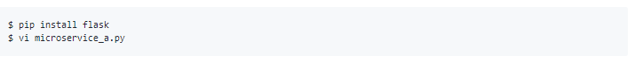

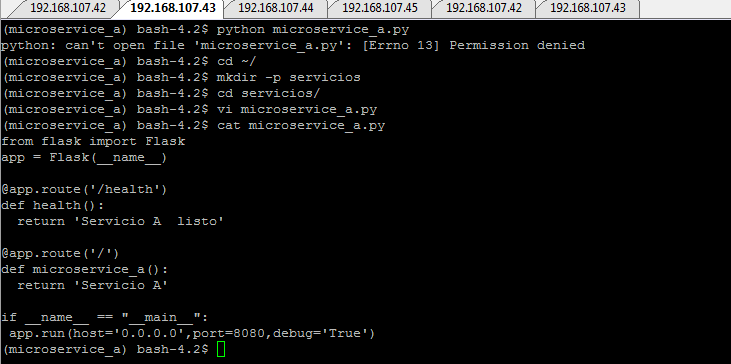

Y ejecutamos el microservicio con el comando:: $python microservice_a.py.

Se recomienda hacerlo en una sesión de screen para que corra en otro plano.

Despues de esto, creamos un archivo de configuración para el microservicio con un healthcheck:

  su consul
  echo '{"service": {"name": "microservice-a", "tags": ["flask"], "port": 8080,
  "check": {"script": "curl localhost:8080/health >/dev/null 2>&1", "interval": "10s"}}}' >/etc/consul.d/microservice-a.json
  
 Iniciamos el agente en modo cliente (Usando una sesión de screen):
 
 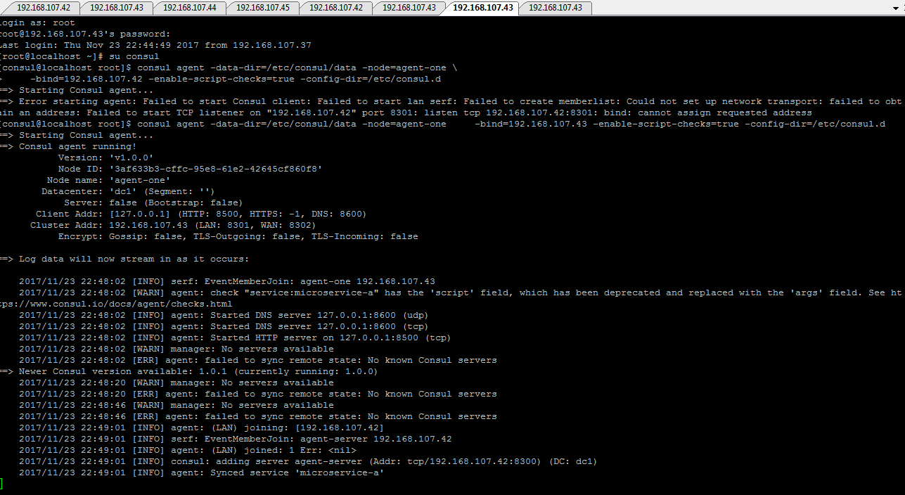
 
 Unimos el cliente al ambiente de servicio (Le pasamos la ip de nuestro agente servidor):
 
 $ consul join 192.168.107.42
 
 Podemos verificar la lista de miembros del ambiente y ver que aparece nuestro agente cliente:
 
 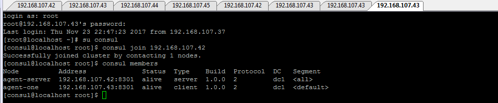
 
### Balanceador de carga

En un nodo diferente configuramos el balanceador de carga.

Instalamos las dependencias necesarias:

 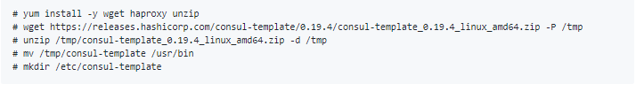
 
 Abrimos los puertos en el firewall necesarios para el balanceador (Haproxy):
 
 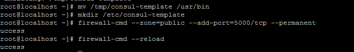
 
 Configuramos la plantilla  del consul-template
 
  vi /etc/consul-template/haproxy.tpl
  
 
 Dentro de la plantilla seteamos la ip de nuestro servidor:
 
   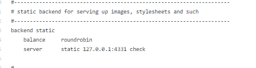
   
  Ejecutamos el siguiente comando para generar el archivo de condifuración del haproxy y verificamos que este configurado correctamente:
  
  consul-template -consul-addr "192.168.56.102:8500" -template "/etc/consul-template/haproxy.tpl:/etc/haproxy/haproxy.cfg" -once
  
  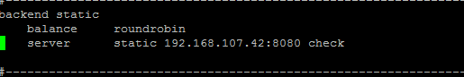
  
  Con esto completamos los modulos necesarios para el esquema 1.
  
  4. Ahora adicionamos un servicio igual al ya desplegado para evidenciar como las peticiones al balanceador son dirigidas a la replica del servicio.
  
  ### Microservico B
  
  Procedemos igualmente que el microservicio A configurado anteriormente:
  
  Instalamos las dependencias en un nodo diferente:
  
   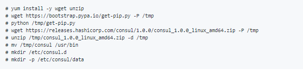
   
   
  Abrimos los puertos en el firewall necesarios para el agente consul y para poder acceder al microservicio:
   
      firewall-cmd --zone=public --add-port=8301/tcp --permanent
      firewall-cmd --reload
      firewall-cmd --zone=public --add-port=8080/tcp --permanent
      firewall-cmd --reload
      
      
  Creamos e inciamos el ambiente microservice_b:
    
  
      
  Instalamos la libreria flask en el ambiente y modificamos el archivo microservice_b.py
      
  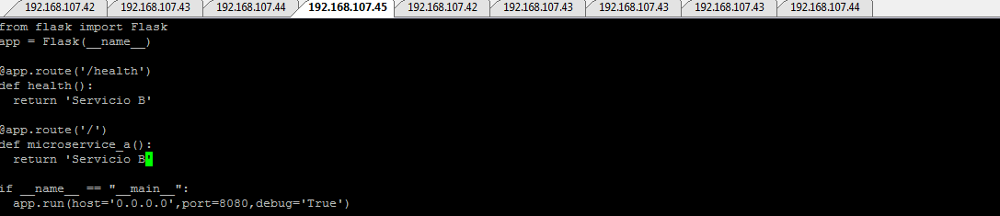
       
  Ejecutamos el script con el comando: $python microservice_b.py
        
  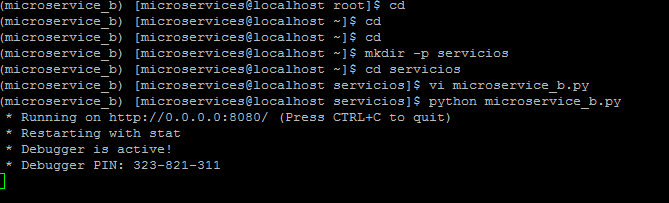
        
  Creamos el archivo de configuración del microservicio con un healthcheck:
       
       su consul 
       echo '{"service": {"name": "microservice-b", "tags": ["flask"], "port": 8080,
       "check": {"script": "curl localhost/health:8080 >/dev/null 2>&1", "interval": "10s"}}}' >/etc/consul.d/microservice-b.json
       
  Iniciamos el agente consul en modo cliente en una sesión de screen:
       
       
  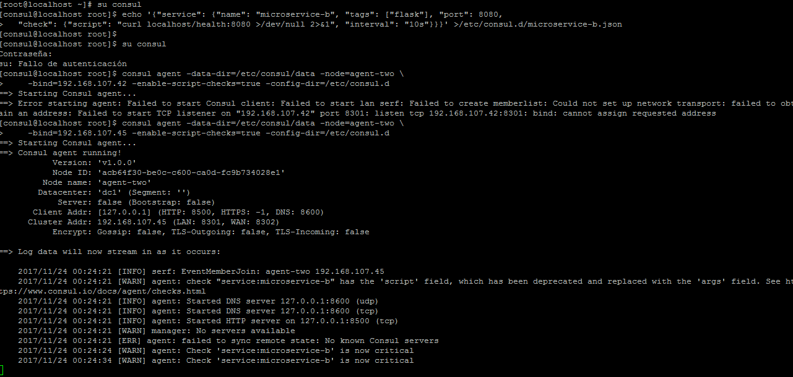 
        
  Unimos el cliente al ambiente y verificamos la lista de miembros:
        
 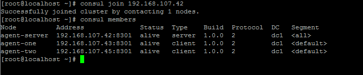
         
   Finalmente, teniendo configurado los dos servicios iguales y el balanceador activo y configurado procedemos a realizar un petición web al balanceador por el puerto habilitado y vemos que en una primera instancia el balanceador dirige la petición al primer servicio:
   
   
 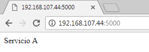
         
 Pero cuando lo volvemos a ejecutar el balanceador dirige la carga a la replica del servicio, es decir, al servicio B:
         
  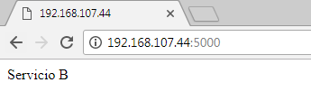

5. Dentro del nodo que  esta sirviendo de web service se crea un nuevo contenedor y dentro de este contenedor se despliega un nuevo servicio web que en este caso seria un nuevo artefacto phyton source (un nuevo contenedor, con un servicio web diferente desplegado dentro de él), aqui se entraria a hacer uso del patron APi Gateway, ya que la implementación de este patron permite redigir la solicitud hacia el servicio web solicitado,funciona como una especie de router (mirandolo desde el punto de vista de redes informaticas). 

      
      
      
     
 El uso de API Gateway tiene los siguientes beneficios:
      
      * Aísla los clientes de cómo la aplicación se divide en microservicios.
      * Aísla a los clientes del problema de determinar las ubicaciones de las instancias de servicio.
      * Proporciona la API óptima para cada cliente
      * Reduce el número de solicitudes / viajes de ida y vuelta. Por ejemplo, API Gateway permite a los clientes recuperar
      datos de múltiples servicios con un solo viaje de ida y vuelta. Menos solicitudes también significa menos sobrecarga y mejora la
      experiencia del usuario.

### Referencias
https://github.com/ICESI/so-microservices-python  
http://microservices.io/patterns/microservices.html  
http://microservices.io/patterns/apigateway.html

